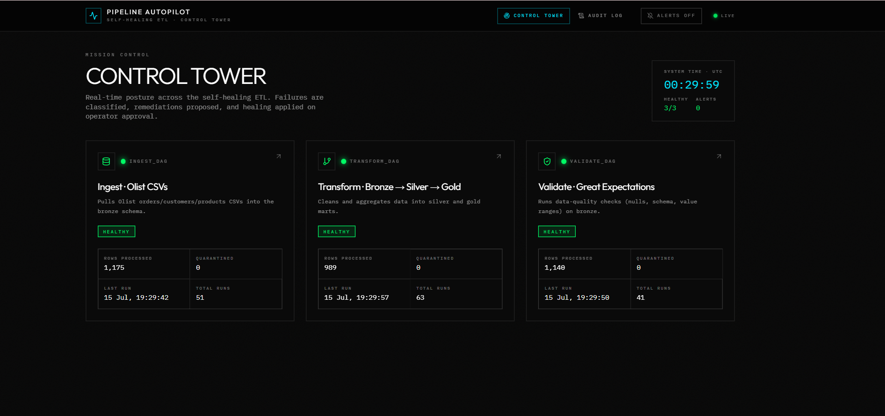
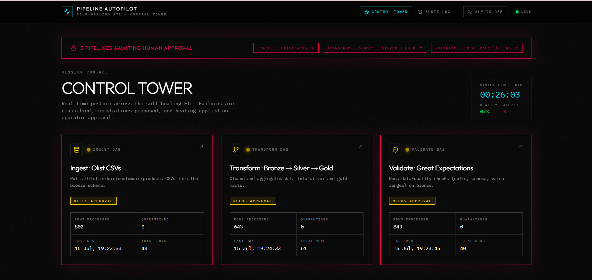
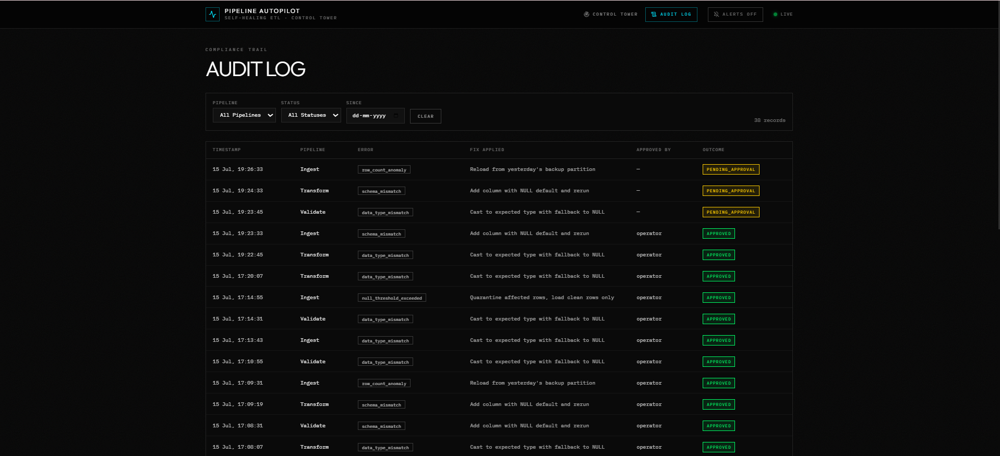
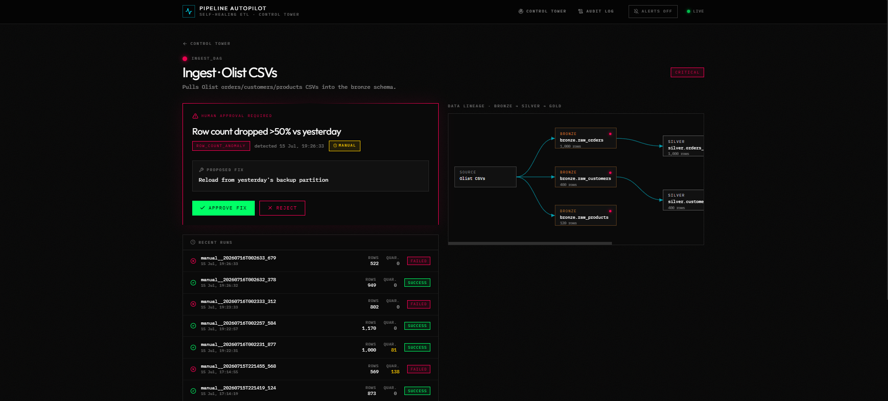
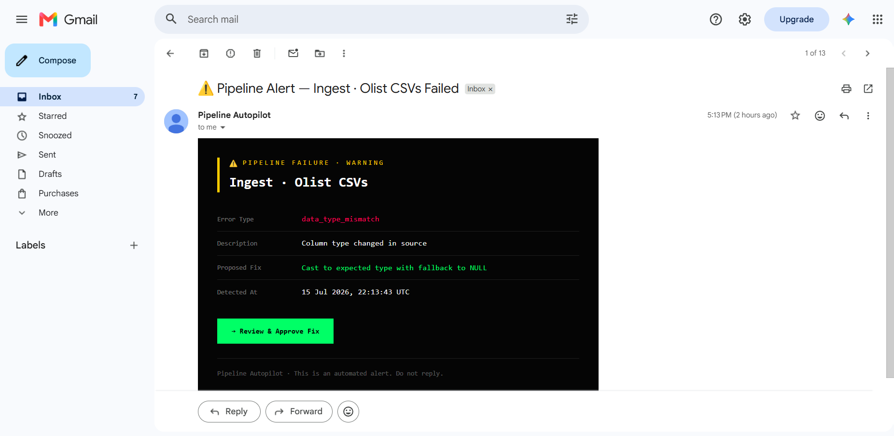
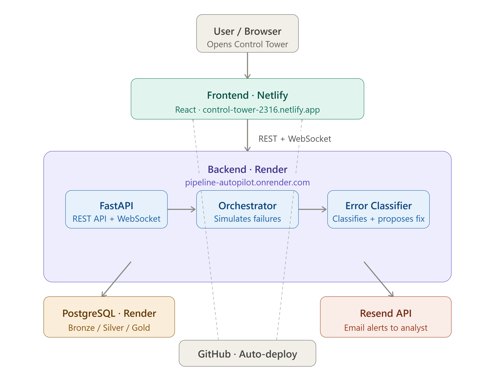

# Control Tower

*A Pipeline Autopilot System for ETL Monitoring and Incident Management*

Control Tower is a full-stack web application that simulates a pipeline autopilot system for modern ETL workflows. It provides a centralized platform to monitor pipeline health, detect failures, recommend remediation actions, and enable operators to approve or reject fixes before they are applied.

Designed with reliability and observability in mind, the application combines automation with human oversight to streamline pipeline operations. Built using **React**, **FastAPI**, and **PostgreSQL**, Control Tower offers real-time monitoring, live updates through WebSockets, audit logging, and email notifications for pipeline failures.

---

## Live Demo

🚀 **Try the application here:**  
**https://control-tower-2316.netlify.app/**

---

# Application Overview

## Dashboard

The dashboard provides a centralized view of all ETL pipelines, displaying their current health, execution statistics, active failures, and overall system status.



---

## Pipeline Details

The Pipeline Details page allows operators to inspect individual pipeline executions, review detected failures, visualize the workflow, and evaluate the recommended remediation before taking action.



---

## Audit History

Every pipeline event is recorded in the audit history, including detected failures, approvals, rejected actions, and remediation activities, ensuring complete traceability.



---

## Approval Workflow

Critical failures requiring manual intervention are highlighted for review. Operators can approve or reject the suggested remediation directly from the application.



---

## Email Alerts

When a pipeline failure is detected, the system automatically sends an email notification containing the error details and recommended remediation.



---

# Features

- Real-time ETL pipeline monitoring
- Centralized dashboard for pipeline management
- Automatic failure detection
- Intelligent error classification
- Suggested remediation actions
- Human approval workflow
- Pipeline execution history
- Complete audit logging
- Live status updates using WebSockets
- Email notifications
- Responsive user interface

---

# Technology Stack

### Frontend

- React
- Tailwind CSS
- React Router
- React Query
- Axios

### Backend

- FastAPI
- Python
- AsyncIO
- WebSockets

### Database

- PostgreSQL

### Additional Tools

- Resend Email API
- Structlog

---

# System Architecture

The application follows a modular architecture where the React frontend communicates with the FastAPI backend, which handles pipeline orchestration, error classification, audit logging, and database operations.



---

# Getting Started

## Clone the Repository

```bash
git clone https://github.com/KavyaSingh236/pipeline-autopilot.git

cd pipeline-autopilot
```

---

## Backend Setup

Create a virtual environment.

```bash
python -m venv venv
```

Activate it.

**Windows**

```bash
venv\Scripts\activate
```

**macOS / Linux**

```bash
source venv/bin/activate
```

Install dependencies.

```bash
pip install -r requirements.txt
```

Start the backend server.

```bash
cd backend

python server.py
```

---

## Frontend Setup

Navigate to the frontend directory.

```bash
cd frontend
```

Install the dependencies.

```bash
npm install
```

Run the application.

```bash
npm start
```

The application will be available at:

```
http://localhost:3000
```

---

# Database Setup

1. Create a PostgreSQL database.
2. Execute the `db_setup.sql` script.
3. Update the backend database configuration.
4. Start both the frontend and backend servers.

---

# API Endpoints

| Method | Endpoint | Description |
|---------|----------|-------------|
| GET | `/api/` | Check API status |
| GET | `/api/playbook` | Retrieve remediation playbooks |
| GET | `/api/pipelines` | Retrieve all pipelines |
| GET | `/api/pipelines/{id}` | Retrieve pipeline details |
| GET | `/api/pipelines/{id}/failures` | Retrieve detected failures |
| POST | `/api/pipelines/{id}/approve` | Approve a suggested remediation |
| POST | `/api/pipelines/{id}/reject` | Reject a suggested remediation |

---

# Workflow

1. The system continuously monitors ETL pipelines.
2. Pipeline failures are automatically detected.
3. Errors are classified based on their type.
4. A recommended remediation is generated.
5. Operators review the recommendation.
6. The suggested action can be approved or rejected.
7. Every action is recorded in the audit history.
8. Email notifications are sent whenever operator attention is required.

---

# Future Enhancements

- Docker support
- Kubernetes deployment
- User authentication
- Role-based access control
- Apache Airflow integration
- Slack and Microsoft Teams notifications
- AI-assisted root cause analysis
- Predictive pipeline failure detection
- Grafana dashboards

---

# Contributors

- **Kavya Singh**
- **Ashwin M**

---

# License

This project was developed for educational and demonstration purposes.
